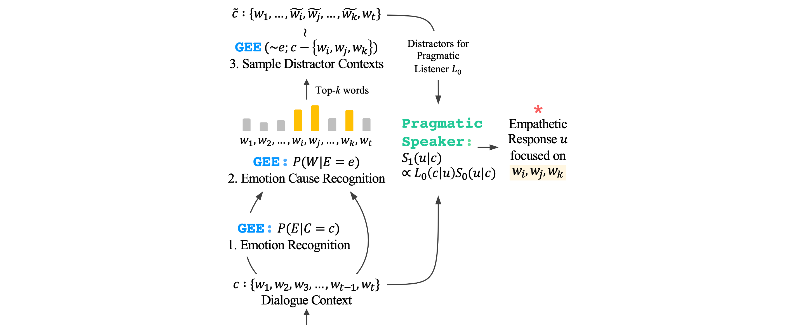
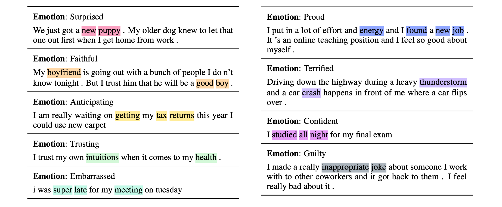

# Perspective-taking and Pragmatics for Generating<br>Empathetic Responses Focused on Emotion Causes



**Official PyTorch implementation and EmoCause evaluation set of our EMNLP 2021 paper 💛**<br>
[Hyunwoo Kim](https://hyunw.kim), [Byeongchang Kim](https://bckim92.github.io), and [Gunhee Kim](https://vision.snu.ac.kr/gunhee). Perspective-taking and Pragmatics for Generating Empathetic Responses Focused on Emotion Causes. _EMNLP_, 2021 [[Paper coming soon!]]()

* **TL;DR**:
In order to express deeper empathy in dialogues, we argue that responses should focus on the cause of emotions.
Inspired by _perspective-taking_ of humans, we propose a **generative emotion estimator (GEE)** which can recognize emotion cause words solely based on sentence-level emotion labels without word-level annotations (_i.e.,_ weak-supervision).
To evaluate our approach, we annotate emotion cause words and release the **EmoCause** evaluation set.
We also propose a _pragmatics-based_ method for generating responses focused on targeted words from the context.


## Reference

If you use the materials in this repository as part of any published research, we ask you to cite the following [paper]():

```bibtex
@inproceedings{Kim:2021:empathy,
  title={Perspective-taking and Pragmatics for Generating Empathetic Responses Focused on Emotion Causes},
  author={Kim, Hyunwoo and Kim, Byeongchang and Kim, Gunhee},
  booktitle={EMNLP},
  year=2021
}
```

## Implementation

### System Requirements

* Python 3.7.9
* Pytorch 1.6.0
* CUDA 10.2 supported GPU with at least 24GB memory
* See [environment.yml](https://github.com/skywalker023/focused-empathy/blob/master/environment.yml) for details

### Environment setup

Our code is built on the [ParlAI](https://parl.ai/) framework. We recommend you create a conda environment as follows

```bash
conda env create -f environment.yml
```

and activate it with

```bash
conda activate focused-empathy
python -m spacey download en
```

## EmoCause evaluation set for weakly-supervised emotion cause recognition
**EmoCause** is a dataset of annotated emotion cause words in emotional situations from the [EmpatheticDialogues](https://aclanthology.org/P19-1534.pdf) valid and test set.
The goal is to recognize emotion cause words in sentences by training only on sentence-level emotion labels without word-level labels (*i.e., weakly-supervised emotion cause recognition*).
**EmoCause** is based on the fact that humans do not recognize the cause of emotions with supervised learning on word-level cause labels.
Thus, we do not provide a training set.



You can download the **EmoCause** eval set [[here]](https://drive.google.com/file/d/1LR4B47Fna_l63G1X4DZtuttG-GrinnaY/view?usp=sharing).<br>
Note, the dataset will be downloaded automatically when you run the experiment command below.


### Data statistics and structure

|          | #Emotion | Label type | #Label/Utterance | #Utterance |
|----------|:--------:|:----------:|:----------------:|:----------:|
| **EmoCause** |    32    |    Word    |        2.3       |    4.6K    |

```
{
  "original_situation": the original situations in the EmpatheticDialogues,
  "tokenized_situation": tokenized situation utterances using spacy,
  "emotion": emotion labels,
  "conv_id": id for each corresponding conversation in EmpatheticDialogues,
  "annotation": list of tuples: (emotion cause word, index),
  "labels": list of strings containing the emotion cause words
}
```

## Running Experiments

All corresponding models will be downloaded automatically when running the following commands.<br>
We also provide manual download links: [[GEE]](https://drive.google.com/file/d/1TEKp3YRowAZju4UPXOSufqzU6j6_Z4wy/view?usp=sharing) [[Finetuned Blender]](https://drive.google.com/file/d/1WwSy0D1KzhhOOpXmBRQMJzp0aJ2K0bDv/view?usp=sharing)

### Weakly-supervised emotion cause word recognition with GEE on EmoCause

You can evaluate our proposed Generative Emotion Estimator (GEE) on the EmoCause eval set.

```bash
python eval_emocause.py --model agents.gee_agent:GeeCauseInferenceAgent --fp16 False
```

### Focused empathetic response generation with finetuned Blender on EmpatheticDialogues

You can evaluate our approach for generating focused empathetic responses on top of a finetuned Blender (Not familiar with Blender? See [here](https://parl.ai/projects/recipes/)!).

```bash
python eval_empatheticdialogues.py --model agents.empathetic_gee_blender:EmpatheticBlenderAgent --model_file data/models/finetuned_blender90m/model --fp16 False --empathy-score False
```

Adding the `--alpha 0` flag will run the Blender without pragmatics. You can also try the random distractor (Plain S1) by adding `--distractor-type random`.

💡 To measure the Interpretation and Exploration scores also, set the `--empathy-score` to `True`. It will automatically download the RoBERTa models finetuned on EmpatheticDialogues. For more details on empathy scores, visit the original [repo](https://github.com/behavioral-data/Empathy-Mental-Health).

## Acknowledgements

We thank the anonymous reviewers for their helpful comments on this work.

This research was supported by Samsung Research Funding Center of Samsung Electronics under project number SRFCIT210101. The compute resource and human study are supported by Brain Research Program by National Research Foundation of Korea (NRF) (2017M3C7A1047860).

## Have any question?
Please contact [Hyunwoo Kim](https://hyunw.kim) at hyunw.kim at vl dot snu dot ac dot kr.


## License

This repository is MIT licensed. See the [LICENSE](https://github.com/skywalker023/focused-empathy/blob/master/LICENSE) file for details.
